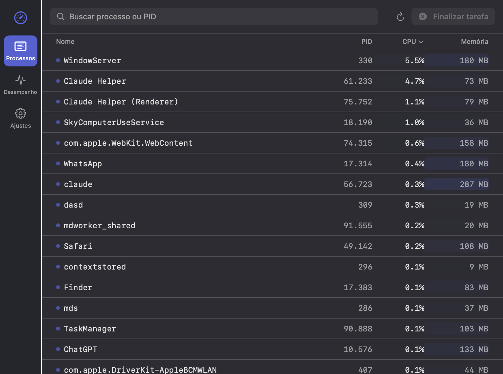
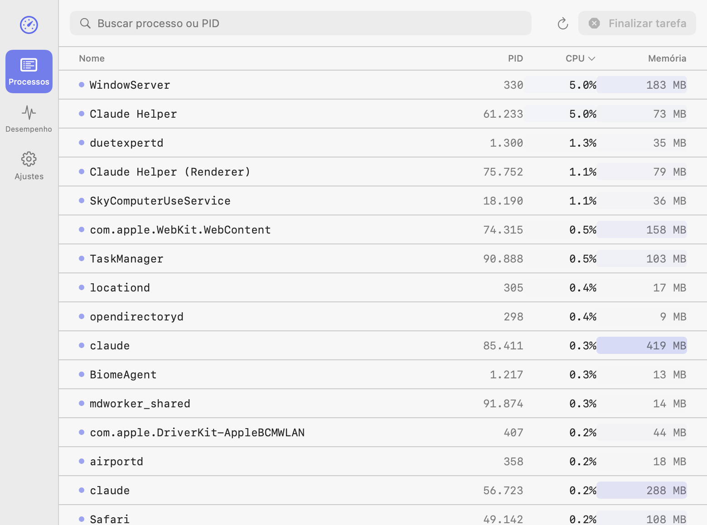

<div align="center">

# Task Manager

**Windows 11's Task Manager, native to macOS.**

Live process list, CPU/memory/disk graphs, and a configurable global shortcut — default `⌘⇧⎋` (Cmd+Shift+Esc) — to open it from anywhere, just like `Ctrl+Shift+Esc` on Windows.

[](https://github.com/spxmiguel/mac-task-manager/releases)
[](#requirements)
[](#structure)
[](#installation)
[](LICENSE)

</div>

---

## Screenshots

Follows the system's light/dark theme automatically (System Settings > General > Appearance on macOS):

<table>
<tr>
<td></td>
<td></td>
</tr>
<tr>
<td align="center">Dark mode</td>
<td align="center">Light mode</td>
</tr>
</table>

---

## Installation

The easiest way, via [Homebrew](https://brew.sh):

```bash
brew tap spxmiguel/tap                              # adds my personal package repo to Homebrew
brew trust --cask spxmiguel/tap/task-manager        # trusts the tap (a safety gate for third-party taps — since this one is mine, it's safe to trust)
brew install --cask task-manager                    # downloads the source code and builds the app on your machine
```

This **builds the app on your own machine** instead of downloading a prebuilt binary:

- Detects whether you have the Xcode Command Line Tools (free, no paid license/account needed)
- If you don't, it kicks off the install and waits for it to finish on its own
- Once ready, it builds and installs the app in `/Applications` — no manual step

Building locally also means **no Gatekeeper warning** ("unidentified developer"), since that warning only shows up for prebuilt binaries downloaded from elsewhere.

Open it from Spotlight or directly at `/Applications/TaskManager.app`. Done — `⌘⇧⎋` already works out of the box.

---

## What's included

| | |
|---|---|
| **Processes** | Live list (refreshes every 2s), sortable by name / PID / CPU / memory, search by name or PID, `End task` with confirmation, `Force quit` in the context menu. CPU usage above 50% shows in red. |
| **Performance** | CPU with a real-time graph, memory and disk — read directly via native system APIs (Mach/Darwin), no shell out. |
| **Settings** | Global shortcut you can record live (click and press the desired combination), default `⌘⇧⎋`. Option to launch automatically at login. Toggle to show/hide the app icon in the Dock — when off, the app stays available only from the menu bar and the global shortcut. |
| **Menu bar** | Persistent icon: click to open/close the window, right-click for `Show/Hide` or `Quit`. |
| **Appearance** | Automatic light/dark, pulled from the system. |

Focused on the essentials (Processes, Performance, Settings) — doesn't cover Windows tabs like App history, Startup, Users, or Services.

---

## Requirements

- macOS 13 (Ventura) or later
- Apple Silicon or Intel

---

## Build from source

Requires the Xcode Command Line Tools (`xcode-select --install`).

```bash
git clone https://github.com/spxmiguel/mac-task-manager.git  # download the source code
cd mac-task-manager                                           # enter the project folder
./build_app.sh                                                # builds and packages into TaskManager.app (locally signed)
open TaskManager.app                                          # opens the freshly built app
```

The `build_app.sh` script builds in release mode, packages it into `TaskManager.app`, and signs it locally (ad-hoc) so Gatekeeper doesn't block it.

To iterate quickly without packaging (builds and runs directly, without producing the `.app`):

```bash
swift run
```

---

## Structure

```
Sources/TaskManager/
├── AppDelegate.swift        # main window, menu bar icon, wires up the global shortcut
├── HotKeyManager.swift      # global shortcut via Carbon Event Manager (no Accessibility permission needed)
├── ProcessMonitor.swift     # process snapshot via `ps`
├── SystemStats.swift        # CPU / memory / disk via Mach/Darwin
├── SettingsStore.swift      # persists the chosen shortcut
└── Views/                   # SwiftUI screens (Processes, Performance, Settings)
```

---

<div align="center">

Made by [@spxmiguel](https://github.com/spxmiguel)

</div>
